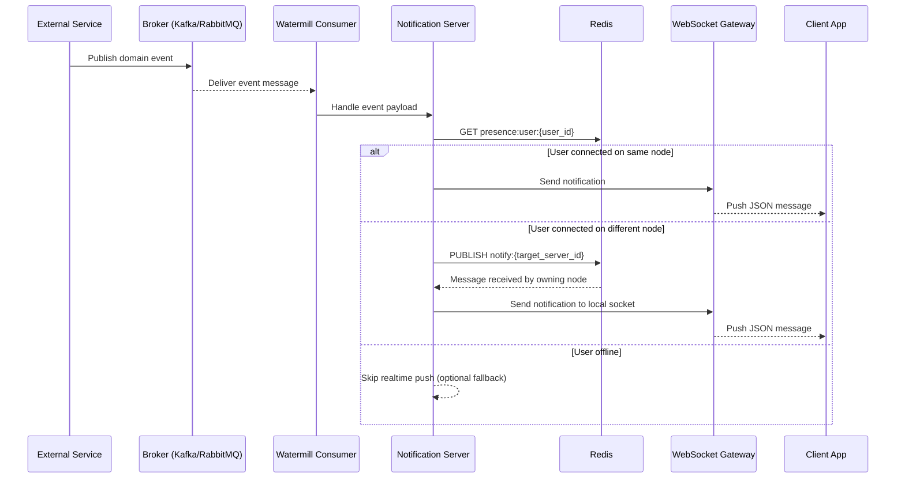

# Notification Server Architecture

## Overview

The Notification Server is an event-driven system that consumes domain events from a message broker and delivers user-facing notifications in near real time over WebSockets. It is designed for low-latency delivery, safe horizontal scaling, and clear separation between event producers and delivery infrastructure.

## Core Components

| Component | Responsibility | Why It Exists |
|---|---|---|
| External Services | Emit business events (payment, chat, social, system). | Decouples producer domains from notification delivery concerns. |
| Message Broker (Kafka/RabbitMQ) | Buffers and distributes events. | Enables asynchronous processing and backpressure handling. |
| Watermill Consumer | Subscribes to broker topics/queues and runs handlers. | Provides reliable message handling patterns in Go with middleware, retries, and routing. |
| Notification Server | Transforms events into client-ready payloads. | Centralizes notification rules and delivery logic. |
| Redis | Stores presence/connection routing and supports Pub/Sub fan-out. | Enables cross-node awareness in multi-instance deployments. |
| WebSocket Gateway | Maintains persistent client sessions. | Supports low-latency push notifications to online users. |

## Event-Driven Processing Flow

1. An external service publishes a domain event into Kafka or RabbitMQ.
2. Watermill receives the event via subscribed handlers.
3. The Notification Server validates and normalizes the event payload.
4. Redis is queried to determine the target user's active node and connection state.
5. If the user is connected on the same node, the notification is pushed directly to the local WebSocket connection.
6. If the user is connected on a different node, the event is forwarded via Redis Pub/Sub to the owning node.
7. The owning node pushes the notification to the client over WebSocket.
8. Delivery outcomes are optionally logged for observability and retries.

## Why Watermill

**Watermill** is used as the broker abstraction and message-handling framework because it gives:

- **Broker abstraction**: unified patterns for Kafka and RabbitMQ without rewriting business handlers.
- **Composable middleware**: retries, correlation IDs, logging, metrics, and poison message handling.
- **Explicit routing**: clear mapping of event topics to handlers.
- **Operational safety**: supports idempotent handler design and at-least-once processing patterns.
- **Go-native ecosystem**: lightweight integration with existing Go services and deployment pipelines.

## Why Redis

**Redis** is used for real-time routing metadata and cross-node messaging because it offers:

- **Fast presence lookups**: low-latency key/value access for user-to-node mapping.
- **Ephemeral state support**: ideal for connection state with TTL and quick updates.
- **Pub/Sub fan-out**: efficient forwarding of notifications between nodes.
- **Horizontal scalability enabler**: avoids sticky routing requirements at the load balancer layer.
- **Simple operational model**: easy to operate as shared infra for multiple notification instances.

## Deployment Topology

Typical production topology:

- Multiple Notification Server instances behind a Layer 4/Layer 7 load balancer.
- Shared Redis cluster for connection routing and Pub/Sub channels.
- Shared Kafka/RabbitMQ cluster for event transport.
- Stateless notification nodes, with connection ownership tracked dynamically in Redis.

## Sequence Diagram

## Reliability and Delivery Notes

- **Delivery semantics**: design handlers for at-least-once event processing.
- **Idempotency**: include event IDs and dedupe logic where duplicate delivery is possible.
- **Backpressure**: broker-level buffering protects producer services during traffic spikes.
- **Failure isolation**: notification failure does not block producer service transactions.
- **Observability**: log `event_id`, `user_id`, `topic`, `server_id`, and delivery status.
